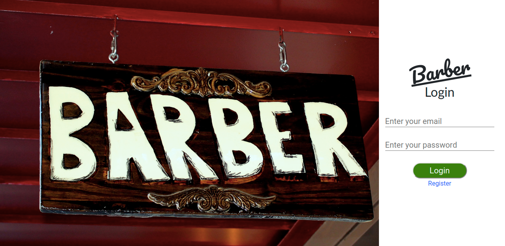
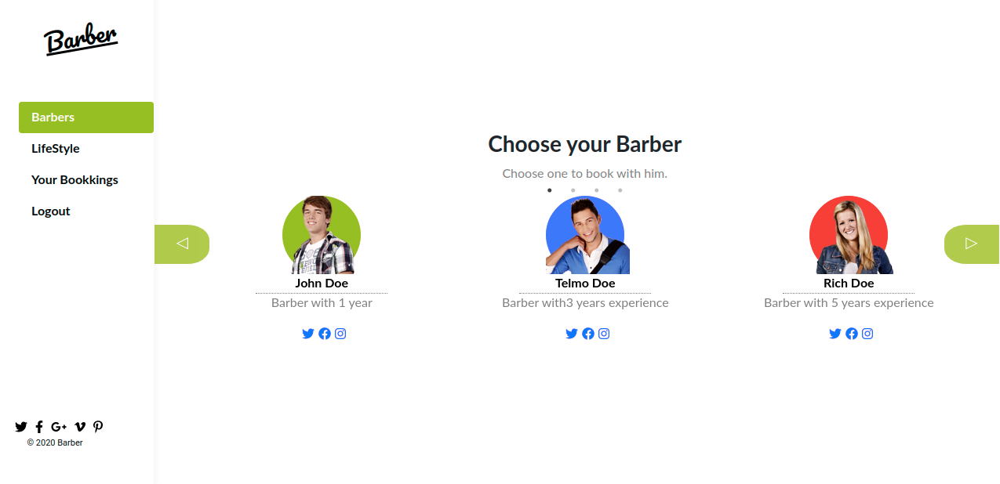
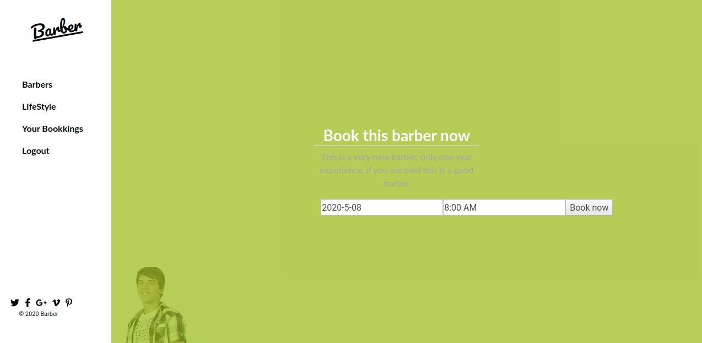
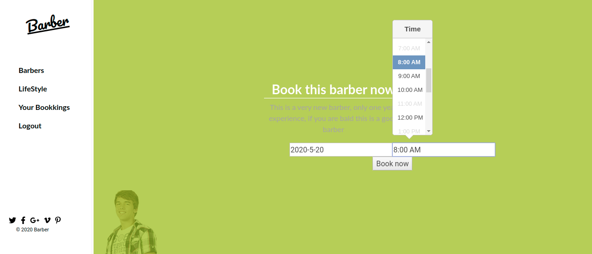

# Barber Booking App - API
An app that allow users to book a barber. The purpose of the entire project is to work with a full-stack ( ruby on rails and react).
On a new version it will allow the barber to register too (Front End). But since this is the API, you can do it here.
This is just the API
## Built With
- Ruby
- Ruby on Rails Framework
- Rspec

## Getting Started

Open the [Live Demo Link](https://antoniobarberapi.herokuapp.com/) .

## Author

👤 António Fernandes

[Github](https://github.com/trox115) | [Twitter](https://twitter.com/rock_67) 

## 🤝 Contributing
Contributions, issues and feature requests are welcome!

Feel free to check the issues page.

Need More Work:
- use Active Storage for Barber Photos
- Write more tests

## Show your support
Give a star ⭐️ if you like this project!

# Required Installations

If you want a copy of this project running on your machine you have to install:

* Ruby 2.6.3
* Rails 6.0.2.2


For installation instructions follow [The Instalation Guide](https://www.tutorialspoint.com/ruby-on-rails/rails-installation)


# Instalation of This App

Once you have installed the requiered packages shown on the [Required Installations](), proceed with the following steps

Clone the Repository, the folder barber-api will be downloaded

```Shell
your@pc:~$ git clone https://github.com/trox115/barber-api.git
```

Move to the downloaded folder

```Shell
your@pc:~$ cd barber-api
```

install gems

```Shell
your@pc:~$ bundle install --without production
```

migrate the database

```Shell
your@pc:~$ rails db:create
your@pc:~$ rails db:migrate
```
Finally, run the test suite to verify that everything is working correctly:

```Shell
your@pc:~$ rspec
```
If the test suite passes, you'll be ready to run the app in a local server:

If you desire to create dummy data to see the apps functionallity run

```Shell
your@pc:~$ rails db:seed

```
it will create Barbers and a user Test

To manually add a barber use:
```Shell
your@pc:~$ rails console
rbenv :001 > Barber.create("name"=>"John Doe", "short_description"=>"Barber with 1 year", "facebook"=>"https://facebook.com", "twitter"=>"https://twitter.com", "instagram"=>"https://instagram.com", "photo_link"=>"barber1", "description"=>"This is a very new barber, only one year experience but the price is cheap and if you want a bald haircut there is no way this could be wrong", "color"=>"#96BF24"). 

```
lastly run the server

```Shell
your@pc:~$ rails server -p 3001

```

Then, go to [http://localhost:3001/](http://localhost:3001/)

Voila!

You have the backend running.

## Warning - You need the frontend for the entire app to work. 
You can get it [here](https://github.com/trox115/booking/)


## Barber App Features - FrontEnd and API

To view the live demo click the [link](https://antoniobarberapi.com) and you will be taken to the login page. You may register or you can login with:
- email: test@test.com
- password: 1234 



### Pick a barber
After the login you will be presented with all barbers, you may slide left or right until you find your favourite barber to book an appointment.



### Check de description
After you pick a barber, you can check the description.



### Pick a date and a time
You may now choose your favourite date and time. Note that, if the barber is already booking for that time the time color will be gray. If the barber has all time slots booked, the day will appear as grey and none clickable.



After you book your appointment you will be redirected to your bookings page.


## Acknowledgments

[Murat Korkmaz on Behance](https://www.behance.net/gallery/26425031/Vespa-Responsive-Redesign) inspired the front-end design.

### License

This project is MIT licensed.
